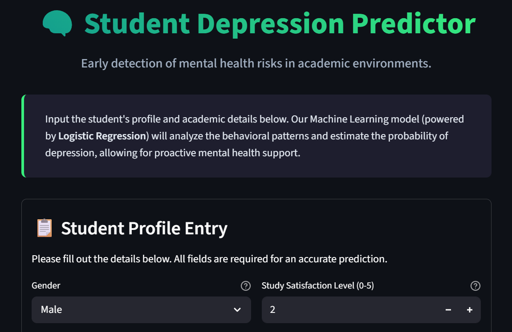
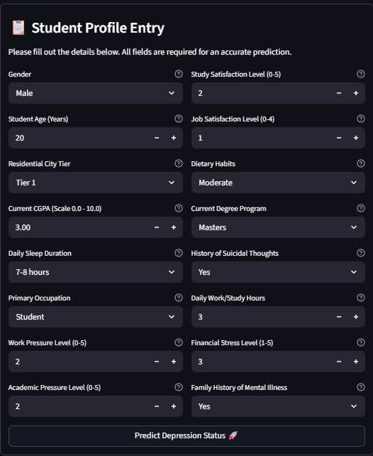
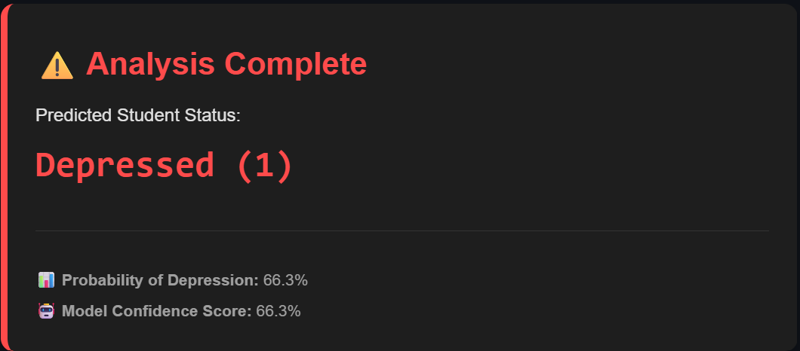
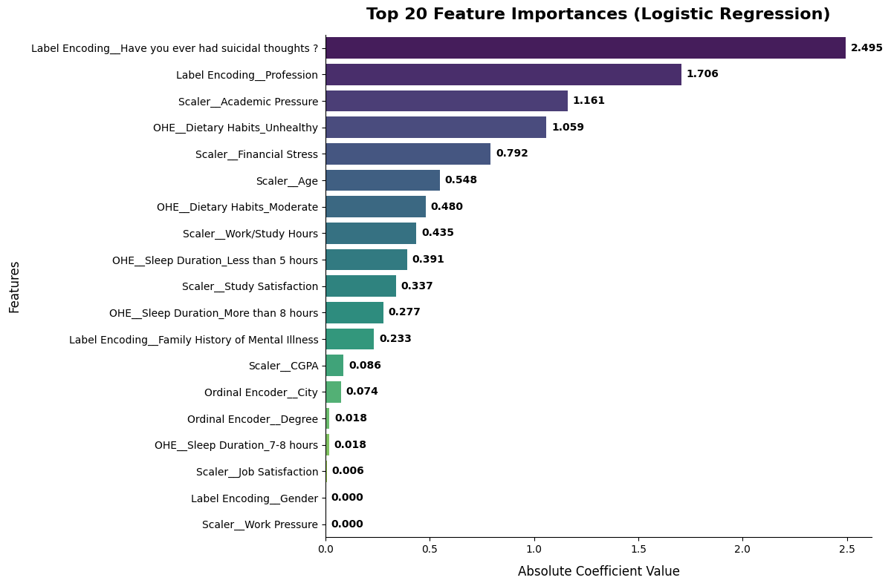
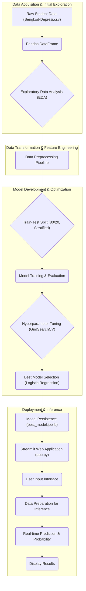

# 🚀 Student Depression Predictor


## 📌 Overview

The **Student Depression Predictor** is a sophisticated, end-to-end Machine Learning solution meticulously engineered to assess the risk of depression in students. This project integrates a robust data pipeline, encompassing extensive exploratory data analysis (EDA), multi-stage data preprocessing, comparative model training (featuring Logistic Regression, Random Forest, XGBoost, KNN, and Naive Bayes), intelligent feature selection, and rigorous hyperparameter tuning. The culmination of this effort is a production-ready Logistic Regression model, deployed as an intuitive Streamlit web application, providing real-time inference for proactive mental health support.

> ⚠️ **Note**: This is an **assignment (fast-track) version** of the project. 
> The notebook workflow contains several intentional structural trade-offs 
> (e.g., baseline modelling performed prior to full preprocessing, EDA conducted 
> on pre-cleaned data). A cleaner, production-ready version with a proper 
> end-to-end workflow is currently in development. 🚀 **Coming Soon.**

## 🎯 Context & Problem Statement

The escalating prevalence of mental health challenges among students presents a critical societal and educational concern. Untreated depression can severely impact academic performance, social integration, and long-term well-being. Traditional diagnostic methods often rely on subjective assessments and may not identify at-risk individuals early enough for effective intervention.

This project directly addresses this challenge by leveraging Machine Learning to develop an **early detection system for student depression risk**. By analyzing a comprehensive set of behavioral, academic, and lifestyle patterns, the system provides a data-driven approach to identify students who may be at risk. The primary business goal is to empower educational institutions and counselors with a proactive tool. This enables them to intervene swiftly and effectively, providing timely support and resources before a student's mental health condition deteriorates, thereby fostering a healthier and more supportive academic environment.

## 📊 Quantitative Metrics & Business Impact

The Student Depression Predictor is designed for high impact, focusing on accurately identifying students at risk. The final model, a tuned Logistic Regression, demonstrates robust performance:

*   **Dataset Size**: The system processes 27,876 clean records, meticulously refined from an initial 28,008 raw entries.
*   **Feature Set**: The model operates on a focused set of 13 features, intelligently selected from an initial 16 to maximize predictive power and minimize noise.
**Final Model Chosen**: Logistic Regression (Non-tuned, with Feature Selection), optimized for `recall`.
    *   **Accuracy**: 84.31%
    *   **Recall**: 89%
    *   **Precision**: 85%
    *   **F1-Score**: 87%

**Business Impact:**
The **high recall of 89%** is particularly significant. In the context of depression prediction, recall measures the model's ability to correctly identify students who *are* depressed (true positives) out of all truly depressed students. A high recall minimizes **false negatives** – cases where a depressed student is incorrectly classified as non-depressed. This is paramount for early intervention, as missing an at-risk student could have severe consequences. By effectively identifying nearly 9 out of 10 students who are struggling, the system provides an invaluable safety net for educational institutions.

**Top Predictive Features:**
The interpretability of Logistic Regression allows us to pinpoint the most influential factors:
1. `Have you ever had suicidal thoughts?`: Coefficient of 2.496, indicating a very strong positive correlation with depression risk.
2. `Profession = Working`: Coefficient of 1.740, suggesting that individuals who are already working face compounded pressures from balancing professional and academic responsibilities, significantly elevating their depression risk.
3. `Academic Pressure`: Coefficient of 1.163, highlighting the significant role of academic stress.

These insights not only drive accurate predictions but also inform targeted support programs, allowing counselors to focus on key areas impacting student mental health. The system's ability to provide a probability score further empowers counselors to prioritize cases and tailor interventions with greater precision.

## 📷 Screenshots & Demo

This section provides visual examples of the Student Depression Predictor in action.

### 1. 🏠 Landing Interface
  
*The initial user interface of the Streamlit application, welcoming users and providing an overview of the prediction system.*

### 2. 📝 Student Profile Input Form
  
*A detailed form where users input various student attributes, including demographic, academic, lifestyle, and psychological factors, essential for the depression risk assessment.*

### 3. ✅ Prediction Result Display
  
*The output screen displaying the prediction result, indicating the student's depression risk status, the probability score, and the model's confidence in its assessment.*

### 4. 📊 Feature Importance Visualization
  
*A hypothetical visualization showcasing the relative importance of different features in the model's prediction, providing transparency and interpretability to the user.*

## ⚙️ Architecture & Data Flow

The Student Depression Predictor is built upon a robust, end-to-end Machine Learning pipeline, meticulously designed to transform raw student data into actionable insights. The architecture follows a standard MLOps lifecycle, from data ingestion and preprocessing to model training, evaluation, and deployment via an interactive web application.

### 🌊 Overall Data Flow

*Note: This architecture diagram is AI-generated using Mermaid.js. If you encounter rendering issues on certain platforms, minor manual syntax adjustments (e.g., escaping special characters or fixing subgraph IDs) may be required.*

### 🔐 Core Components:

#### 1. 📥 Data Ingestion
*   **Source**: Student data is loaded from a CSV file, `Bengkod-Depresi.csv`.
*   **Mechanism**: The data is immediately converted into a Pandas DataFrame, which serves as the foundational data structure for all subsequent operations. This ensures efficient data manipulation and compatibility with Python's rich data science ecosystem.

#### 2. 🔍 Exploratory Data Analysis (EDA)
Conducted within a Jupyter Notebook, the EDA phase is critical for understanding the dataset's characteristics and informing preprocessing strategies:
*   **Basic Inspection**: Initial checks with `df.head()`, `df.info()`, `df.describe()` provide a quick overview of data types, missing values, and statistical summaries.
*   **Quality Checks**:
    *   **Missing Values**: `df.isnull().sum()` identifies columns with missing data, guiding imputation strategies.
    *   **Duplicate Rows**: `df.duplicated().sum()` detects and quantifies redundant records, which are subsequently removed to prevent bias.
    *   **Unique Value Analysis**: Inspection of unique values and their counts for each column helps reveal cardinality, potential typos, and anomalous entries.
*   **Distribution Analysis**:
    *   **Target Variable**: Bar plots visualize the `Depression` target variable distribution, crucial for identifying class imbalance.
    *   **Numerical Features**: Box plots (for outlier detection) and histograms (for distribution shape) provide insights into continuous data.
    *   **Categorical Features**: Count plots show frequency distributions, often stratified by the `Depression` target, alongside proportion plots to highlight depression rates per category.
*   **Relationship Analysis**:
    *   **Correlation Heatmaps**: Visualize linear relationships between numerical features, including their correlation with the `Depression` target.
    *   **Box Plots (Numerical vs. Target)**: Illustrate how the ranges and distributions of numerical features differ between depressed and non-depressed groups.

#### 3. 🧹 Data Preprocessing Pipeline
This is a multi-stage, iterative process, ultimately encapsulated within an `ImbPipeline` for robustness.
*   **Duplicate Handling**: 46 duplicate rows are precisely identified and removed using `df.drop_duplicates()`, ensuring data integrity.
*   **Missing Value Imputation**:
    *   Rows with missing `Depression` values (42 records) are dropped, as the target variable is fundamental and cannot be reliably imputed.
    *   For other features like `Financial Stress` (numerical) and `Family History of Mental Illness` (categorical), `SimpleImputer` is employed: numerical columns are imputed with the **median**, while categorical columns use the **most frequent** value (mode).
*   **Feature Cleaning & Engineering**:
    *   **`id` Column**: Removed due to its lack of predictive power.
    *   **`Dietary Habits`**: Anomalous "///" entries are remapped to "Others," and then all "Others" records are removed to maintain data quality and focus on core categories ("Unhealthy", "Moderate", "Healthy").
    *   **`City`**: Invalid city names (typos, non-city entries) are corrected or removed. Valid cities are then intelligently grouped into "Tier 1" (major metropolitan) and "Tier 2" (other cities) to reduce cardinality and capture urban influence. The application UI intentionally includes "Tier 3" as a  forward-compatible option — designed to accommodate Tier 3 data in future model iterations without requiring UI changes.
    *   **`Degree`**: 28 granular academic degrees are consolidated into 5 broader, more meaningful categories: "High School", "Bachelors", "Masters", "Doctorate", "Others".
    *   **`CGPA`**: Rows with a `CGPA` of 0 are removed, as this is deemed illogical for active students and likely represents data entry errors.
*   **Feature Selection**: Based on initial Logistic Regression coefficients and EDA, three features (`Gender`, `Job Satisfaction`, `Work Pressure`) are identified as having low predictive contribution and are dropped, reducing the feature set from 16 to 13.
*   **Transformation with `ColumnTransformer`**: A `ColumnTransformer` is used to apply distinct transformations based on feature type:
    *   **Categorical Features**: `OneHotEncoder` is applied with `drop="first"` (to mitigate multicollinearity) and `handle_unknown="ignore"` (for graceful handling of unseen categories during inference).
    *   **Numerical Features**: `StandardScaler` normalizes these features, critical for models sensitive to feature scales (e.g., Logistic Regression, KNN).

#### 4. 🧠 Model Training & Evaluation
This phase focuses on comparative analysis, feature importance, and hyperparameter optimization.
*   **Train-Test Split**: The cleaned and preprocessed dataset is split into 80% training and 20% testing sets using `train_test_split` with `stratify=y` to preserve the target variable's class distribution and `random_state` for reproducibility. This is done *before* fitting the `ColumnTransformer` to prevent data leakage.
*   **Pipeline Integration**: The `ImbPipeline` from `imblearn` is instrumental. It chains the `ColumnTransformer` (preprocessor) and the Machine Learning model, ensuring that all preprocessing steps are consistently applied and fitted *only* on the training data, preventing data leakage during cross-validation and evaluation.
*   **Evaluated Models**: Five diverse classification algorithms are benchmarked: `LogisticRegression`, `RandomForestClassifier`, `XGBClassifier`, `KNeighborsClassifier`, and `BernoulliNB`.
*   **Evaluation Metrics**: Each model's performance is rigorously assessed using `accuracy_score`, `recall_score`, `precision_score`, `f1_score`, `classification_report`, and `confusion_matrix`. ROC curves and AUC scores provide further insights into classifier performance.
*   **Feature Importance**: For the chosen Logistic Regression model, absolute coefficients are extracted and visualized, offering clear interpretability by highlighting the most influential features.
*   **Hyperparameter Tuning**: `GridSearchCV` combined with `StratifiedKFold` (5 splits) is used to meticulously tune the `LogisticRegression` model's hyperparameters (`C`, `tol`, `solver`, `max_iter`), with a specific focus on optimizing for `recall` to maximize the detection of true positive depression cases.

#### 5. 🚀 Model Deployment (Inference Service)
The final, optimized model is deployed as an interactive Streamlit web application.
*   **Model Persistence**: The entire `ImbPipeline` (containing the preprocessor and the tuned Logistic Regression model) is saved using `joblib.dump` to `best_model.joblib`, ensuring the complete pipeline can be loaded for inference.
*   **Model Loading (`function.py`)**: The `load_models()` function uses `joblib.load()` to efficiently load the saved pipeline. `@st.cache_resource` is employed to cache the model, loading it only once when the Streamlit app starts, significantly boosting performance. Robust error handling is included for file not found or corrupted model files.
*   **Data Preparation for Inference (`function.py`)**: The `change_data_to_df()` function takes raw user inputs from the Streamlit UI, constructs a Pandas DataFrame, and critically, *drops the insignificant features* (`Gender`, `Job Satisfaction`, `Work Pressure`) to ensure the input schema precisely matches what the trained `best_model` expects.
*   **Prediction Logic (`function.py`)**: The `predict_status()` function orchestrates the prediction process. It calls `best_model.predict()` for the binary outcome and `best_model.predict_proba()` for probability scores. The numerical predictions are then mapped to human-readable labels and formatted for clear display in the UI.
*   **Streamlit User Interface (`app.py`)**: A user-friendly and visually appealing web interface is crafted using Streamlit components. Users interact with `st.selectbox`, `st.number_input`, and `st.form_submit_button` to input student details. Upon submission, `app.py` seamlessly integrates with `function.py` to prepare data and obtain predictions. The results (depression status, probability, confidence) are then presented in a customized HTML card, enhancing user experience.

## 💻 Installation & Reproduction Steps

To set up and run the Student Depression Predictor locally, follow these steps.

### ⚙️ Prerequisites
*   **Python**: Version 3.8 or higher.
*   **Git**: For cloning the repository.

### 📦 1. Clone the Repository
Open your terminal or command prompt and execute the following command:
```bash
git clone https://github.com/viochris/Depression-Prediction.git
cd Depression-Prediction
```

### 🐍 2. Create a Virtual Environment (Recommended)
It's best practice to work within a virtual environment to manage dependencies:
```bash
python -m venv venv
# On Windows
.\venv\Scripts\activate
# On macOS/Linux
source venv/bin/activate
```

### 📥 3. Install Dependencies
Install all required Python packages using `pip`:
```bash
pip install -r requirements.txt
```
*Note: The `requirements.txt` file will contain all necessary libraries like `pandas`, `numpy`, `scikit-learn`, `streamlit`, `xgboost`, `imblearn`, `joblib`, `matplotlib`, and `seaborn`.*

### ▶️ 4. Run the Streamlit Application
Once all dependencies are installed, you can launch the interactive web application:
```bash
streamlit run app.py
```
This command will open the application in your default web browser, typically at `http://localhost:8501`.

### 🧪 5. Reproduce Model Training & Evaluation (Optional)
If you wish to explore the model training, EDA, and preprocessing steps, you can open the Jupyter Notebook:
```bash
jupyter notebook
```
Navigate to the relevant `.ipynb` file in the repository (e.g., `Depression_Prediction_Notebook.ipynb`) and run the cells sequentially.

## ⚠️ System Limitations & Future Work

Understanding the limitations of any system is crucial for responsible deployment and future enhancements. This project, while robust, has inherent architectural and runtime constraints.

### 🚧 Architectural Limitations:
1.  **In-Memory Processing**: The entire dataset is loaded and processed in memory using Pandas. While efficient for the current dataset size (~28,000 records), this architecture is not scalable for significantly larger datasets (e.g., millions or billions of records) without transitioning to distributed computing frameworks like Dask or Apache Spark.
2.  **Single-Machine Deployment**: The Streamlit application is designed for interactive, single-user inference. It lacks the infrastructure for high-throughput, concurrent requests typical of enterprise-grade production API services. Scaling to multiple concurrent users or integrating with other systems would necessitate a more robust deployment strategy, potentially involving containerization (Docker), orchestration (Kubernetes), a backend API framework (Flask/FastAPI), and load balancing.
3.  **Lack of Asynchronous Operations**: The current codebase executes synchronously. While sufficient for the relatively low latency of this model's inference, for I/O-bound operations or potentially longer-running model inferences in future iterations, an asynchronous architecture could improve responsiveness and user experience.
4.  **Limited Model Explainability in Deployment**: Although Logistic Regression coefficients are analyzed in the development notebook, the deployed Streamlit application only provides the prediction and confidence score. Advanced explainability techniques (e.g., LIME or SHAP) are not currently implemented or exposed to the end-user. This limits the transparency and trustworthiness of individual predictions for non-technical users or counselors.
5.  **Hardcoded Configurations**: Critical configurations, including `RANDOM_SEED`, specific column names, and file paths, are hardcoded within the scripts. This reduces flexibility for different environments, dataset versions, or experimental setups, requiring direct code modification for any changes.
6.  **No Data Versioning or MLOps**: The project currently lacks explicit mechanisms for data versioning, model versioning, or automated MLOps pipelines. Any updates to the model or changes in the underlying data would require manual retraining, saving, and redeployment, which can be error-prone and time-consuming in a production environment.

### 🐛 Runtime Limitations:
1.  **Suboptimal Direct Modelling Workflow**: The initial "Direct Modelling" (baseline evaluation) was performed *before* the full data preprocessing pipeline was applied. This means the baseline models were trained on raw, uncleaned data (e.g., containing noise, invalid city names, ungrouped degree values). This makes the comparison of preprocessing impact not fully "apple-to-apple" and might slightly misrepresent the true uplift from comprehensive preprocessing.
2.  **Misleading Initial EDA**: The initial Exploratory Data Analysis (EDA) was conducted on the raw, pre-cleaning dataset. Consequently, some early visualizations (e.g., distributions of `City`, `Degree`, `Dietary Habits`) contained misleading insights due to unstandardized or anomalous values (e.g., `City` column still contained people's names and academic degree titles). While corrected in later preprocessing, this highlights the importance of iterative EDA.
3.  **Model Selection Rationale**: Logistic Regression was ultimately chosen as the final model primarily for its interpretability (due to its coefficients), which aligns well with academic and counseling purposes. This choice was made despite other models like Random Forest or XGBoost reportedly having comparable or slightly superior raw predictive performance. This implies a conscious trade-off between maximizing raw predictive power and prioritizing model interpretability for practical application.
4.  **Geographic Specificity**: The dataset used for training is India-centric, featuring Indian city names and reflecting a specific Indian social and academic context. The model's generalization capabilities to student populations in other countries (e.g., Indonesia, as hinted by the dataset name) are not guaranteed and would require thorough validation, and potentially retraining, with local data from those regions.
5.  **High Reliance on 'Suicidal Thoughts' Feature**: The model exhibits a significantly high reliance on the 'Have you ever had suicidal thoughts?' feature, evidenced by its large coefficient (2.496) compared to others. While highly predictive, this raises substantial ethical concerns regarding its mandatory use as an input in a real-world application. It could be perceived as intrusive, stigmatizing, or lead to misinterpretations and misuse of predictions, potentially causing distress to students. Future work should explore ways to mitigate this reliance or offer alternative, less sensitive pathways for prediction.

---
**Author:** [Silvio Christian, Joe](https://github.com/viochris)
"The true measure of a system's intelligence is its ability to foster well-being."
